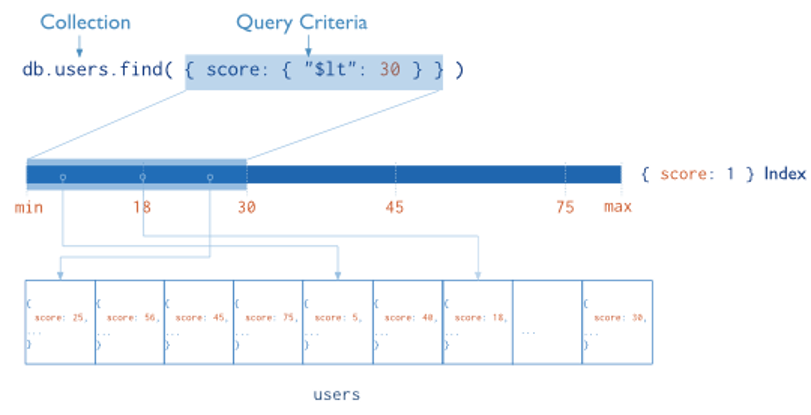
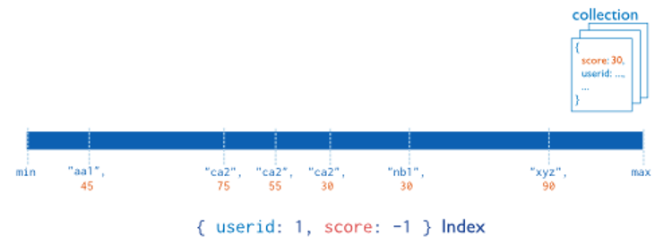
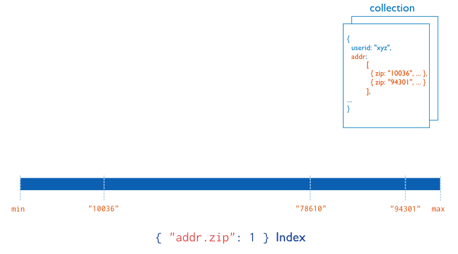

# Indexing

## Background

* Indexes provide performance for quering.
* Without indexes every document must be scanned (Collection Scan).
* Indexes can be applied to a set of fields and sub-fields.
* If the data needed is in the index, it can be used directly for results.
* Indexes use a B-tree daya structure.

**Diagram of a query selecting documents using an index. MongoDB narrows the query by scanning the range of documents with values of score less than 30.**

## Query Optimization
* The query optimizer creates and caches query plans for queries.
* Use explain() to view statistics about the query plan used.
* How it works
    * Query plans are run against several indexes in parallel.
    * Results are recorded in one or more buffers.
    * A plan is seleted once results are returned or a plan is determined to be superior.
    * The selected index is then uses for future queries.
    * Over time query plans are deleted and re-evaluated.

### Sorted Results
* Return results sorted from the index key.

**Diagram of a query that uses an index to select and return sorted results. The index stores score values in ascending order. MongoDB can traverse the index in either ascending or descending order to return sorted results.**

### Covered Results
* Return results directly from the index.

**Diagram of a query that uses only the index to match the query criteria and return the results. MongoDB does not need to inspect data outside of the index to fulfill the query.**

## Index Types
There are a few different types of indexes you can create.

### Default _id index
* Every collection has this index
* It is applied to the _id field of each document.

### Single field indexes
* The default index is a single field index.

**Diagram of an index on the score field (ascending).**

### Compound indexes
* Multi-field indexes.
* Each field can be sorted differently.

**Diagram of a compound index on the userid field (ascending) and the score field (descending). The index sorts first by the userid field and then by the score field.**

### Multikey indexes
* Indexes based on values stored in arrays.
* Separate index entries are created for every element.

**Diagram of a multikey index on the addr.zip field. The addr field contains an array of address documents. The address documents contain the zip field.**

### Geospatial indexes
* Indexes that support geospatial coordinate data.
* Will talk more in next section.

### Text Indexes
* Search string content.
* Only root words are stored.
* Stop words like "the", "a" and "or" are filtered out.

## Demo
We are going to run some queires and apply indexes to see how they work. We have a large collection that contains the maxmind data for the United States.

### Let's look at the indexes that exist:

**Query:**

	db.maxmind.getIndexes()

**Result:**

	{
	    "0" : {
	        "v" : 1,
	        "key" : {
	            "_id" : 1
	        },
	        "name" : "_id_",
	        "ns" : "workshop.maxmind"
	    }
	}

Here we see the default index for the __id_ field.

### Let's see how many documents are in this collection:

**Query:**

	db.maxmind.find().count()

**Result:**

	357815

### Run a query against the start___ip_number field and ask MongoDB to explain the plan:

**Query:**

	db.maxmind.find().count()
	db.maxmind.find({"start_ip_number":135836344}).count()
	db.maxmind.find({"start_ip_number":135836344}).explain()

**Result:**

	357815

	1

	{
	    "cursor" : "BasicCursor",
	    "isMultiKey" : false,
	    "n" : 1,
	    "nscannedObjects" : 357815,
	    "nscanned" : 357815,
	    "nscannedObjectsAllPlans" : 357815,
	    "nscannedAllPlans" : 357815,
	    "stats" : {
	        "type" : "COLLSCAN",
	        "works" : 357817,
	        "yields" : 2795,
	        "unyields" : 2795,
	        "invalidates" : 0,
	        "advanced" : 1,
	        "needTime" : 357815,
	        "needFetch" : 0,
	        "isEOF" : 1,
	        "docsTested" : 357815,
	        "children" : []
	    }
	}

We can see by explain, a COLLSCAN is taking place and all the documents were scanned.

	nscanned:
	Number of items (documents or index entries) examined. Items might be objects or index keys. If a "covered index" is involved, nscanned may be higher than nscannedObjects.

	nscannedObjects:
	Number of documents scanned.

### Create a single field index on the start___ip_number field:

**Query**

	db.maxmind.ensureIndex({"start_ip_number": 1})
	db.maxmind.getIndexes()

**Result:**

	{
	    "0" : {
	        "v" : 1,
	        "key" : {
	            "_id" : 1
	        },
	        "name" : "_id_",
	        "ns" : "workshop.maxmind"
	    },
	    "1" : {
	        "v" : 1,
	        "key" : {
	            "start_ip_number" : 1
	        },
	        "name" : "start_ip_number_1",
	        "ns" : "workshop.maxmind"
	    }
	}

Now a new index exists called *start_ip_number_1*.

### Run query again with new index:

**Query:**

	db.maxmind.find().count()
	db.maxmind.find({"start_ip_number":135836344}).count()
	db.maxmind.find({"start_ip_number":135836344}).explain()

**Result:**

	357815

	1

	{
	    "cursor" : "BtreeCursor start_ip_number_1",
	    "isMultiKey" : false,
	    "n" : 1,
	    "nscannedObjects" : 1,
	    "nscanned" : 1,
	    "nscannedObjectsAllPlans" : 1,
	    "nscannedAllPlans" : 1,
	    "scanAndOrder" : false,
	    "indexOnly" : false,
	    "nYields" : 0,
	    "nChunkSkips" : 0,
	    "millis" : 0,
	    "indexBounds" : {
	        "start_ip_number" : [ 
	            [ 
	                135836344, 
	                135836344
	            ]
	        ]
	    },
	    "server" : "h004520.mongolab.com:59519",
	    "filterSet" : false,
	    "stats" : {
	        "type" : "FETCH",
	        "works" : 3,
	        "yields" : 0,
	        "unyields" : 0,
	        "invalidates" : 0,
	        "advanced" : 1,
	        "needTime" : 1,
	        "needFetch" : 0,
	        "isEOF" : 1,
	        "alreadyHasObj" : 0,
	        "forcedFetches" : 0,
	        "matchTested" : 0,
	        "children" : [ 
	            {
	                "type" : "IXSCAN",
	                "works" : 2,
	                "yields" : 0,
	                "unyields" : 0,
	                "invalidates" : 0,
	                "advanced" : 1,
	                "needTime" : 1,
	                "needFetch" : 0,
	                "isEOF" : 1,
	                "keyPattern" : "{ start_ip_number: 1.0 }",
	                "isMultiKey" : 0,
	                "boundsVerbose" : "field #0['start_ip_number']: [135836344.0, 135836344.0]",
	                "yieldMovedCursor" : 0,
	                "dupsTested" : 0,
	                "dupsDropped" : 0,
	                "seenInvalidated" : 0,
	                "matchTested" : 0,
	                "keysExamined" : 1,
	                "children" : []
	            }
	        ]
	    }
	}

We can see by explain, a IXSCAN is taking place and only one (1) document was scanned.

### Find records for Miami, FL:

**Query:**

	db.maxmind.find().count()
	db.maxmind.find({"region": "FL", "city":"Jacksonville"}).count()
	db.maxmind.find({"region": "FL", "city":"Jacksonville"}).explain()

**Result:**

	357815

	2536

	{
	    "cursor" : "BasicCursor",
	    "isMultiKey" : false,
	    "n" : 2536,
	    "nscannedObjects" : 357815,
	    "nscanned" : 357815,
	    "nscannedObjectsAllPlans" : 357815,
	    "nscannedAllPlans" : 357815,
	    "scanAndOrder" : false,
	    "indexOnly" : false,
	    "nYields" : 2795,
	    "nChunkSkips" : 0,
	    "millis" : 386,
	    "server" : "h004520.mongolab.com:59519",
	    "filterSet" : false,
	    "stats" : {
	        "type" : "COLLSCAN",
	        "works" : 357817,
	        "yields" : 2795,
	        "unyields" : 2795,
	        "invalidates" : 0,
	        "advanced" : 2536,
	        "needTime" : 355280,
	        "needFetch" : 0,
	        "isEOF" : 1,
	        "docsTested" : 357815,
	        "children" : []
	    }
	}

We can see by explain, a COLLSCAN is taking place and all the documents have been scanned.

### Create a compound field index on the region and city fields:

**Query**

	db.maxmind.ensureIndex({"region": 1, "city": 1})
	db.maxmind.getIndexes()

**Result:**

	{
	    "0" : {
	        "v" : 1,
	        "key" : {
	            "_id" : 1
	        },
	        "name" : "_id_",
	        "ns" : "workshop.maxmind"
	    },
	    "1" : {
	        "v" : 1,
	        "key" : {
	            "start_ip_number" : 1
	        },
	        "name" : "start_ip_number_1",
	        "ns" : "workshop.maxmind"
	    },
	    "2" : {
	        "v" : 1,
	        "key" : {
	            "region" : 1,
	            "city" : 1
	        },
	        "name" : "region_1_city_1",
	        "ns" : "workshop.maxmind"
	    }
	}

Now a new index exists called *region_1_city_1*.

### Run query again with new index:

**Query:**

	db.maxmind.find().count()
	db.maxmind.find({"region": "FL", "city":"Jacksonville"}).count()
	db.maxmind.find({"region": "FL", "city":"Jacksonville"}).explain()

**Result:**

	357815

	2536

	{
	    "cursor" : "BtreeCursor region_1_city_1",
	    "isMultiKey" : false,
	    "n" : 2536,
	    "nscannedObjects" : 2536,
	    "nscanned" : 2536,
	    "nscannedObjectsAllPlans" : 2536,
	    "nscannedAllPlans" : 2536,
	    "scanAndOrder" : false,
	    "indexOnly" : false,
	    "nYields" : 19,
	    "nChunkSkips" : 0,
	    "millis" : 10,
	    "indexBounds" : {
	        "region" : [ 
	            [ 
	                "FL", 
	                "FL"
	            ]
	        ],
	        "city" : [ 
	            [ 
	                "Jacksonville", 
	                "Jacksonville"
	            ]
	        ]
	    },
	    "server" : "h004520.mongolab.com:59519",
	    "filterSet" : false,
	    "stats" : {
	        "type" : "FETCH",
	        "works" : 2538,
	        "yields" : 19,
	        "unyields" : 19,
	        "invalidates" : 0,
	        "advanced" : 2536,
	        "needTime" : 1,
	        "needFetch" : 0,
	        "isEOF" : 1,
	        "alreadyHasObj" : 0,
	        "forcedFetches" : 0,
	        "matchTested" : 0,
	        "children" : [ 
	            {
	                "type" : "IXSCAN",
	                "works" : 2537,
	                "yields" : 19,
	                "unyields" : 19,
	                "invalidates" : 0,
	                "advanced" : 2536,
	                "needTime" : 1,
	                "needFetch" : 0,
	                "isEOF" : 1,
	                "keyPattern" : "{ region: 1.0, city: 1.0 }",
	                "isMultiKey" : 0,
	                "boundsVerbose" : "field #0['region']: [\"FL\", \"FL\"], field #1['city']: [\"Jacksonville\", \"Jacksonville\"]",
	                "yieldMovedCursor" : 0,
	                "dupsTested" : 0,
	                "dupsDropped" : 0,
	                "seenInvalidated" : 0,
	                "matchTested" : 0,
	                "keysExamined" : 2536,
	                "children" : []
	            }
	        ]
	    }
	}

We can see by explain, a IXSCAN is taking place and only 2536 document was scanned.

### Change the query to put city first.

**Query:**

	db.maxmind.find().count()
	db.maxmind.find({"city":"Jacksonville", "region": "FL"}).count()
	db.maxmind.find({"city":"Jacksonville", "region": "FL"}).explain()

**Result:**

	357815

	2536

	{
	    "cursor" : "BtreeCursor region_1_city_1",
	    "isMultiKey" : false,
	    "n" : 2536,
	    "nscannedObjects" : 2536,
	    "nscanned" : 2536,
	    "nscannedObjectsAllPlans" : 2536,
	    "nscannedAllPlans" : 2536,
	    "scanAndOrder" : false,
	    "indexOnly" : false,
	    "nYields" : 19,
	    "nChunkSkips" : 0,
	    "millis" : 4,
	    "indexBounds" : {
	        "region" : [ 
	            [ 
	                "FL", 
	                "FL"
	            ]
	        ],
	        "city" : [ 
	            [ 
	                "Jacksonville", 
	                "Jacksonville"
	            ]
	        ]
	    },
	    "server" : "h004520.mongolab.com:59519",
	    "filterSet" : false,
	    "stats" : {
	        "type" : "FETCH",
	        "works" : 2538,
	        "yields" : 19,
	        "unyields" : 19,
	        "invalidates" : 0,
	        "advanced" : 2536,
	        "needTime" : 1,
	        "needFetch" : 0,
	        "isEOF" : 1,
	        "alreadyHasObj" : 0,
	        "forcedFetches" : 0,
	        "matchTested" : 0,
	        "children" : [ 
	            {
	                "type" : "IXSCAN",
	                "works" : 2537,
	                "yields" : 19,
	                "unyields" : 19,
	                "invalidates" : 0,
	                "advanced" : 2536,
	                "needTime" : 1,
	                "needFetch" : 0,
	                "isEOF" : 1,
	                "keyPattern" : "{ region: 1.0, city: 1.0 }",
	                "isMultiKey" : 0,
	                "boundsVerbose" : "field #0['region']: [\"FL\", \"FL\"], field #1['city']: [\"Jacksonville\", \"Jacksonville\"]",
	                "yieldMovedCursor" : 0,
	                "dupsTested" : 0,
	                "dupsDropped" : 0,
	                "seenInvalidated" : 0,
	                "matchTested" : 0,
	                "keysExamined" : 2536,
	                "children" : []
	            }
	        ]
	    }
	}

The query optimizer is smart enough to know the compund index we created can be used.

### Performing a range query can be tricky:

	db.maxmind.dropIndex({"start_ip_number": 1})
	db.maxmind.ensureIndex({"start_ip_number": 1, "end_ip_number": - 1})

	Over 1 second
	db.maxmind.find({"start_ip_number": { "$lte" : 1050041088}, "end_ip_number": {"$gte" : 1050041088}}).explain()

	{
	    "cursor" : "BtreeCursor start_ip_number_1_end_ip_number_-1",
	    "isMultiKey" : false,
	    "n" : 1,
	    "nscannedObjects" : 1,
	    "nscanned" : 357814,
	    "nscannedObjectsAllPlans" : 1,
	    "nscannedAllPlans" : 357814,
	    "scanAndOrder" : false,
	    "indexOnly" : false,
	    "nYields" : 2796,
	    "nChunkSkips" : 0,
	    "millis" : 997,
	    "indexBounds" : {
	        "start_ip_number" : [ 
	            [ 
	                -Infinity, 
	                1050041088
	            ]
	        ],
	        "end_ip_number" : [ 
	            [ 
	                Infinity, 
	                1050041088
	            ]
	        ]
	    },
	    "server" : "h004520.mongolab.com:59519",
	    "filterSet" : false,
	    "stats" : {
	        "type" : "FETCH",
	        "works" : 357816,
	        "yields" : 2796,
	        "unyields" : 2796,
	        "invalidates" : 0,
	        "advanced" : 1,
	        "needTime" : 357814,
	        "needFetch" : 0,
	        "isEOF" : 1,
	        "alreadyHasObj" : 0,
	        "forcedFetches" : 0,
	        "matchTested" : 0,
	        "children" : [ 
	            {
	                "type" : "IXSCAN",
	                "works" : 357815,
	                "yields" : 2796,
	                "unyields" : 2796,
	                "invalidates" : 0,
	                "advanced" : 1,
	                "needTime" : 357814,
	                "needFetch" : 0,
	                "isEOF" : 1,
	                "keyPattern" : "{ start_ip_number: 1.0, end_ip_number: -1.0 }",
	                "isMultiKey" : 0,
	                "boundsVerbose" : "field #0['start_ip_number']: [-inf.0, 1050041088.0], field #1['end_ip_number']: [inf.0, 1050041088.0]",
	                "yieldMovedCursor" : 0,
	                "dupsTested" : 0,
	                "dupsDropped" : 0,
	                "seenInvalidated" : 0,
	                "matchTested" : 0,
	                "keysExamined" : 357814,
	                "children" : []
	            }
	        ]
	    }
	}

We can see by explain, a IXSCAN is taking place but 357814 documents were searched.

### This query based on the index and knowledge of the data:

	0.04 seconds
	// ipNumber = 1050041088
	// endNumber = ipNumber - 65536 // 1049975552 (Class B Address)

	db.maxmind.find({
	    "$and": [{"start_ip_number": { "$lte" : 1050041088}}, {"start_ip_number": { "$gte" : 1049975552}}],
	    "end_ip_number": {"$gte" : 1050041088}
	}).explain()

	{
	    "cursor" : "BtreeCursor start_ip_number_1_end_ip_number_-1",
	    "isMultiKey" : false,
	    "n" : 1,
	    "nscannedObjects" : 1,
	    "nscanned" : 1,
	    "nscannedObjectsAllPlans" : 1,
	    "nscannedAllPlans" : 1,
	    "scanAndOrder" : false,
	    "indexOnly" : false,
	    "nYields" : 0,
	    "nChunkSkips" : 0,
	    "millis" : 0,
	    "indexBounds" : {
	        "start_ip_number" : [ 
	            [ 
	                1049975552, 
	                1050041088
	            ]
	        ],
	        "end_ip_number" : [ 
	            [ 
	                Infinity, 
	                1050041088
	            ]
	        ]
	    },
	    "server" : "h004520.mongolab.com:59519",
	    "filterSet" : false,
	    "stats" : {
	        "type" : "FETCH",
	        "works" : 3,
	        "yields" : 0,
	        "unyields" : 0,
	        "invalidates" : 0,
	        "advanced" : 1,
	        "needTime" : 1,
	        "needFetch" : 0,
	        "isEOF" : 1,
	        "alreadyHasObj" : 0,
	        "forcedFetches" : 0,
	        "matchTested" : 0,
	        "children" : [ 
	            {
	                "type" : "IXSCAN",
	                "works" : 2,
	                "yields" : 0,
	                "unyields" : 0,
	                "invalidates" : 0,
	                "advanced" : 1,
	                "needTime" : 1,
	                "needFetch" : 0,
	                "isEOF" : 1,
	                "keyPattern" : "{ start_ip_number: 1.0, end_ip_number: -1.0 }",
	                "isMultiKey" : 0,
	                "boundsVerbose" : "field #0['start_ip_number']: [1049975552.0, 1050041088.0], field #1['end_ip_number']: [inf.0, 1050041088.0]",
	                "yieldMovedCursor" : 0,
	                "dupsTested" : 0,
	                "dupsDropped" : 0,
	                "seenInvalidated" : 0,
	                "matchTested" : 0,
	                "keysExamined" : 1,
	                "children" : []
	            }
	        ]
	    }
	}

We can see by explain, a IXSCAN is taking place but this time 1 document was searched.

## Exercises

**Part A:** Perform a _find_ against the _name_ field for the value _"Station 42365 - Ursa"_ from your student database. The run an explain and look at the results.

	db.student.find()
	db.student.find({"name":"Station 42365 - Ursa"})
	db.student.find({"name":"Station 42365 - Ursa"}).explain()

**Part B:** Create a single field index on the _name_ field and run the query again. Run an explain to verify the index is being used and the number of scanned documents is 1.

	db.student.createIndex({"name":1})
	db.student.find({"name":"Station 42365 - Ursa"}).explain()

**Part C:** Create a compound index on the _region_ field and _condition.date_ field. Create a query to find the most recently updated station for the _"Gulf Of Mexico"_. Verify the index is used.

	db.student.createIndex({"region":1, "condition.date": -1})
	db.student.find({"region":"Gulf Of Mexico"}).sort({"condition.date":-1}).limit(1)
	db.student.find({"region":"Gulf Of Mexico"}).sort({"condition.date":-1}).limit(1).explain()

