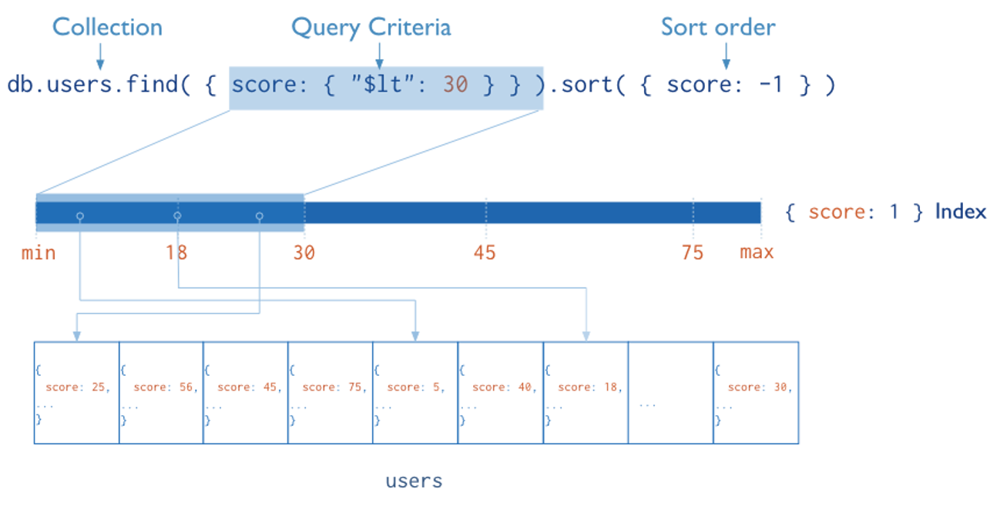
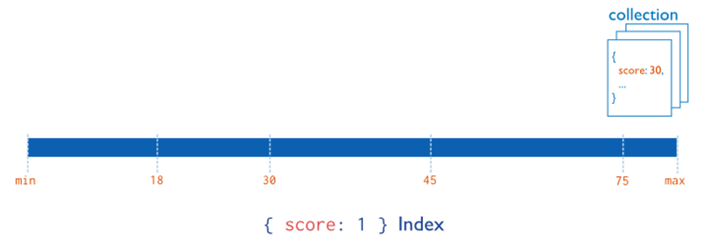

# Indexing

## Background

* Indexes provide performance for quering.
* Without indexes every document must be scanned (Collection Scan).
* Indexes can be applied to a set of fields and sub-fields.
* If the data needed is in the index, it can be used directly for results.
* Indexes use a B-tree daya structure.

**Diagram of a query selecting documents using an index. MongoDB narrows the query by scanning the range of documents with values of score less than 30.**

## Query Optimization
* The query optimizer creates and caches query plans for queries.
* Use explain() to view statistics about the query plan used.
* How it works
    * Query plans are run against several indexes in parallel.
    * Results are recorded in one or more buffers.
    * A plan is seleted once results are returned or a plan is determined to be superior.
    * The selected index is then uses for future queries.
    * Over time query plans are deleted and re-evaluated.

### Sorted Results
* Return results sorted from the index key.

**Diagram of a query that uses an index to select and return sorted results. The index stores score values in ascending order. MongoDB can traverse the index in either ascending or descending order to return sorted results.**

### Covered Results
* Return results directly from the index.

**Diagram of a query that uses only the index to match the query criteria and return the results. MongoDB does not need to inspect data outside of the index to fulfill the query.**

Index Types
-------------------------
There are a few different types of indexes you can create.

### Default _id index
* Every collection has this index
* It is applied to the _id field of each document.

### Single field indexes
* The default index is a single field index.

**Diagram of an index on the score field (ascending).**

### Compound indexes
* Multi-field indexes.
* Each field can be sorted differently.
* The order of the index is very important.

**Diagram of a compound index on the userid field (ascending) and the score field (descending). The index sorts first by the userid field and then by the score field.**

### Multikey indexes
* Indexes based on values stored in arrays.
* Separate index entries are created for every element.

**Diagram of a multikey index on the addr.zip field. The addr field contains an array of address documents. The address documents contain the zip field.**

### Geospatial indexes
* Indexes that support geospatial coordinate data.
* Will talk more in next section.

### Text Indexes
* Search string content.
* Only root words are stored.
* Stop words like "the", "a" and "or" are filtered out.

## Demo
We are going to run some queires and apply indexes to see how they work.

* Single field index

